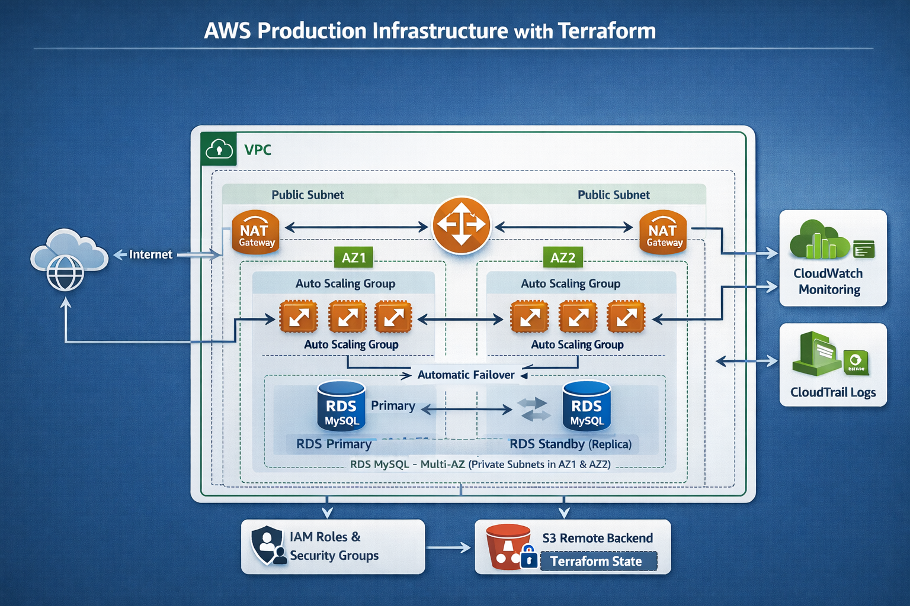

# AWS Production Infrastructure with Terraform

This project deploys a highly available AWS infrastructure using Terraform.

## Architecture

- VPC with public and private subnets across 2 AZs
- NAT Gateway
- Application Load Balancer
- Auto Scaling EC2 instances
- RDS MySQL Multi-AZ
- Security Groups with least privilege
- Terraform modules

## Architecture Diagram

## Deploy

Clone repo:
git clone https://github.com/Roblex-T/terraform-aws-production-infra.git

cd terraform-aws-production-infra

Create variables file by modifying the  example: 

cp terraform.tfvars.example terraform.tfvars

Initialize, plan and apply

terraform init
terraform plan
terraform apply